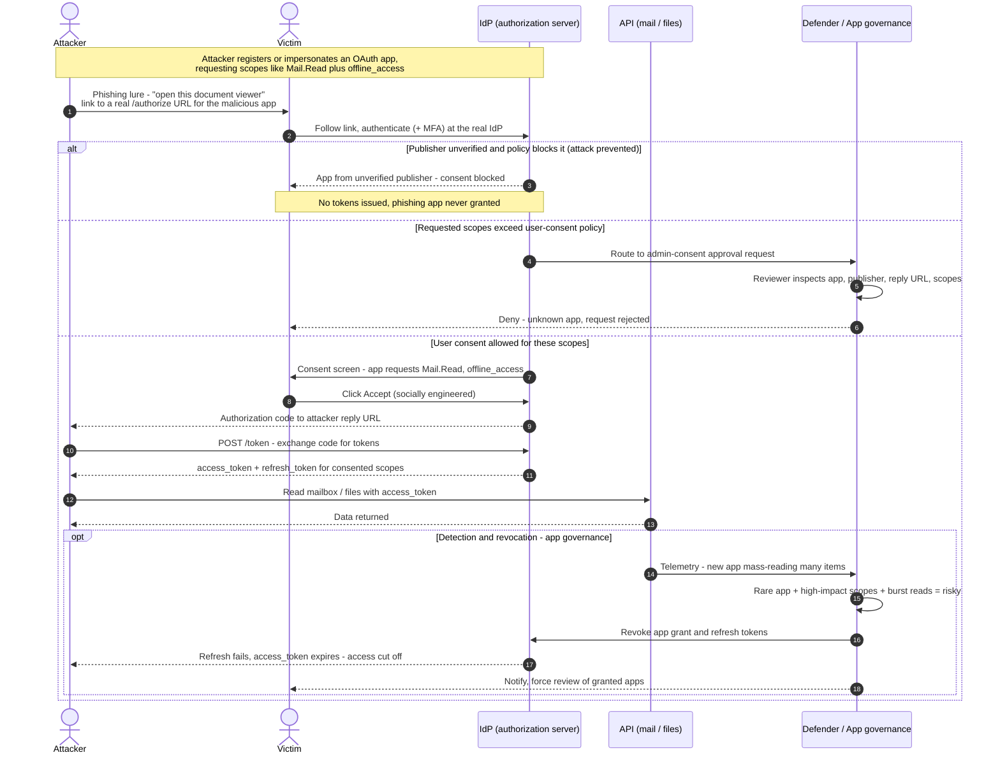

# OAuth Consent Phishing — Sequence Diagram

The attack path (luring a victim to consent to a malicious OAuth app), then the defenses
that block it (admin-consent workflow, publisher verification) or detect and revoke it
(app governance). The **Attacker** never learns the victim's password.

Notes

- Every IdP step is legitimate: the login, MFA, and token issuance are all real. The defect is
  that a human was tricked into **authorizing** an attacker's client.
- Prevention lives in **consent policy** (publisher verification, admin-consent workflow);
  detection and containment live in **app governance** revoking the grant and refresh tokens.
- Because MFA is satisfied during the victim's own login, MFA alone does **not** stop this attack.
