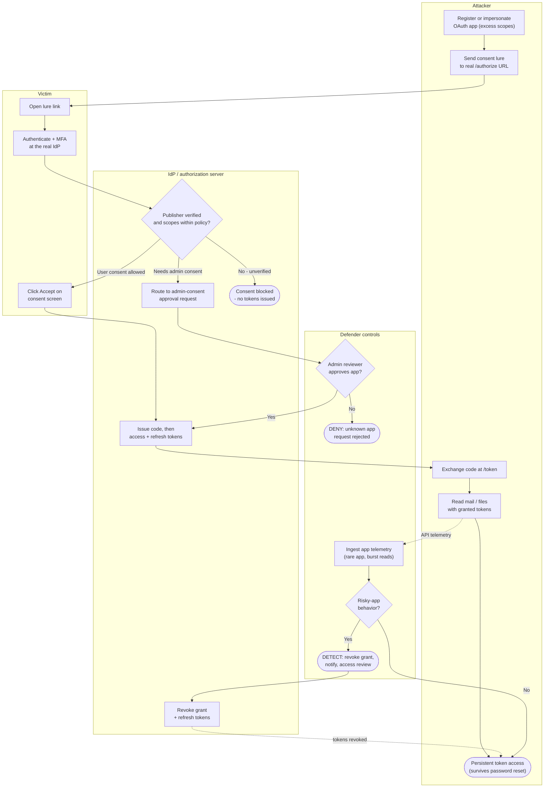

# OAuth Consent Phishing — Swimlane Diagram

Lanes for Attacker, Victim, IdP, and Defender controls. Solid arrows are the phishing/consent
path; dashed arrows into the Defender lane are governance signals and revocation.

Notes

- The Victim performs a real, MFA-backed login — so MFA is not the control that stops this;
  **consent policy** (`I1`) and **app governance** (`D4`) are.
- The only outright-prevention paths are `I1 --> unverified` and the admin reviewer denying
  at `D1`; everything past `I3` is detection and revocation of an already-granted app.
- `A5` is durable precisely because the tokens are legitimate; containment means **revoking the
  grant and refresh tokens**, not resetting the password.
