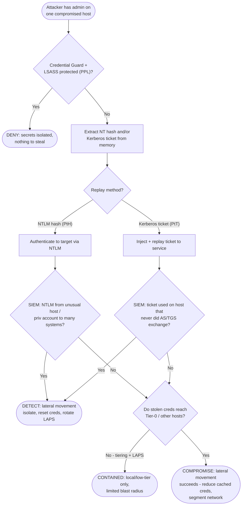

# Pass-the-Hash / Pass-the-Ticket — Decision Flowchart

Where theft prevention, admin tiering, and replay detection force **deny**/**detect**
terminals. Valid credential material always authenticates — so defense is prevent-theft,
contain-reuse, detect-movement.

Notes

- **`CgQ` is the decisive prevention:** Credential Guard plus LSASS PPL removes the ability to
  read hashes/tickets, so PtH/PtT never begin on that host.
- The two `DetQ` branches are the practical detections — NTLM logon anomalies (PtH) and
  tickets appearing without a preceding AS/TGS exchange (PtT).
- **`TierQ`** shows why **tiering + LAPS** matter even after a successful replay: unique local
  passwords and never logging privileged accounts onto low-tier hosts bound the spread.
