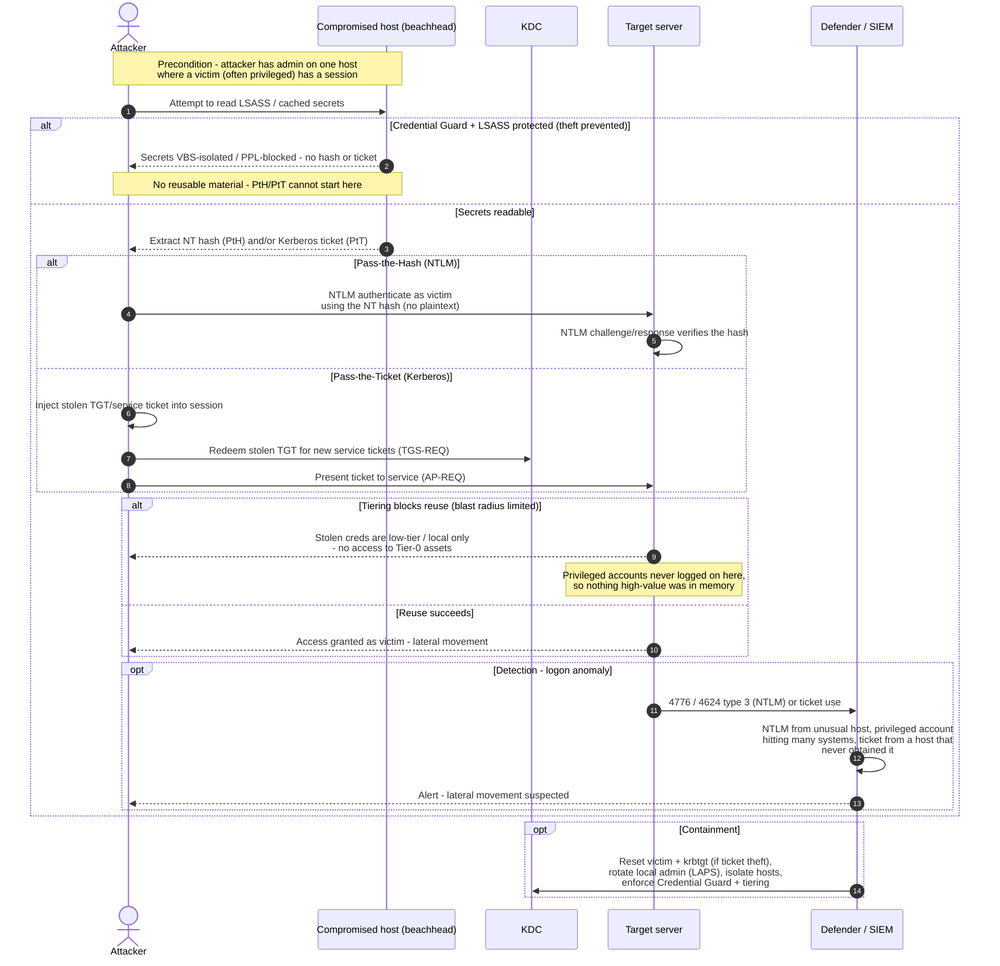

# Pass-the-Hash / Pass-the-Ticket — Sequence Diagram

The replay attack (steal credential material from memory, reuse it against other systems),
then the defenses: Credential Guard/LSASS protection prevent the theft, tiering limits
reuse, and logon-anomaly monitoring detects the movement. The **Attacker** starts on one
compromised beachhead host.

Notes

- PtH replays the **NT hash** into NTLM; PtT injects a **Kerberos ticket** and redeems/presents
  it — see [ap-exchange](../../kerberos/ap-exchange/README.md) and
  [tgs-exchange](../../kerberos/tgs-exchange/README.md).
- The first `alt` (Credential Guard / LSASS PPL) is the prevention that removes the theft
  primitive; tiering limits what reuse can reach; SIEM anomaly rules detect the movement.
- Containment for stolen tickets ultimately means resetting the affected account (and krbtgt
  if a TGT/golden-ticket path is suspected — see [Golden & Silver Ticket](../golden-silver-ticket/README.md)).
