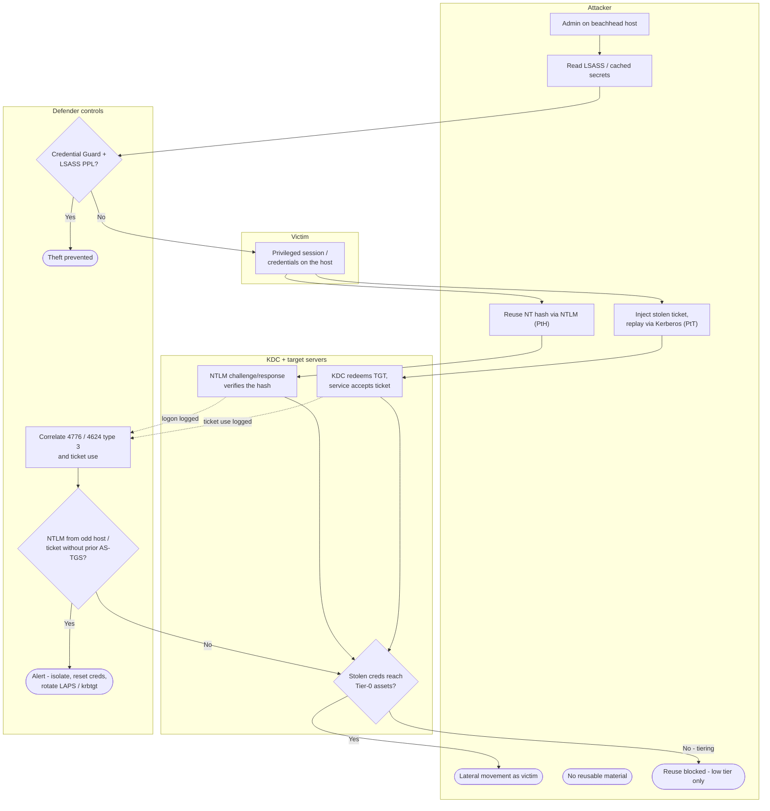

# Pass-the-Hash / Pass-the-Ticket — Swimlane Diagram

Lanes for Attacker, Victim, IdP/servers (KDC and target systems), and Defender controls.
Dashed arrows are detection signals.

Notes

- `D1` (Credential Guard + LSASS PPL) is the single control that stops the attack at the
  source by denying the theft primitive.
- `T1` is the **tiering** gate: even valid reused credentials are contained if privileged
  accounts never touched the beachhead.
- `D4` is behavioral detection — NTLM from an unexpected host, or a ticket used on a system
  that never performed the AS/TGS exchange to obtain it.
