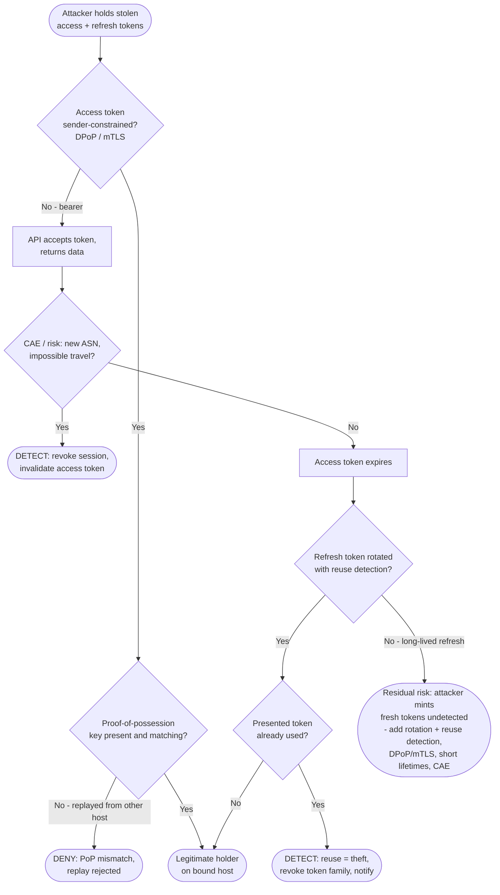

# Token Theft & Replay — Decision Flowchart

Where each control forces a **deny** (prevention) or **detect** terminal. A valid signature alone
never stops replay of a bearer token — so defense depends on token binding and reuse detection.

Notes

- The **binding gate** (`BindQ` / `PopQ`) is the strongest prevention: a sender-constrained token
  is worthless off the victim's host regardless of a valid signature.
- **Rotation + reuse detection** (`RefreshQ` / `ReuseQ`) turns the stolen refresh token into its
  own tripwire — the first replay trips family revocation.
- The `Gap` terminal is honest about residual risk: an unbound bearer token with a long-lived,
  non-rotating refresh token can be replayed quietly, which is why DPoP/mTLS, rotation, and CAE
  together are the durable defense.
