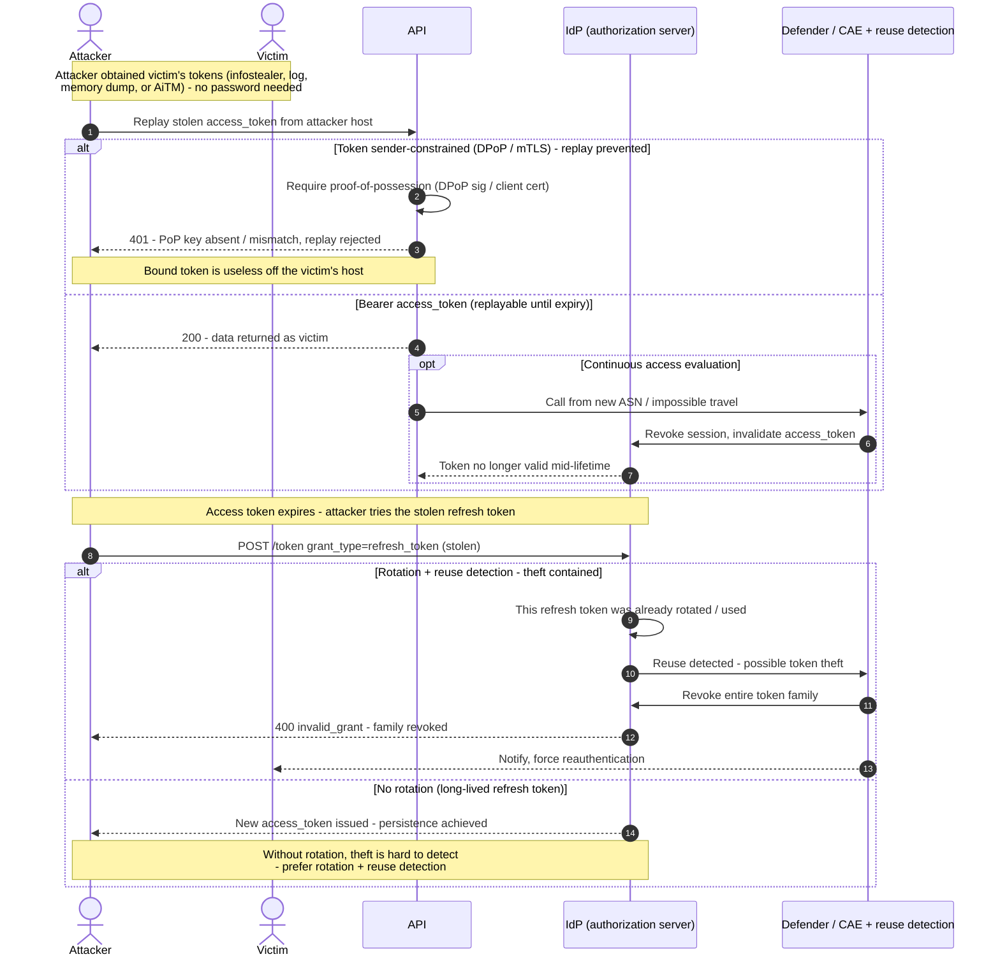

# Token Theft & Replay — Sequence Diagram

The attack path (replaying a stolen access token, then a stolen refresh token from another host),
then the defenses that prevent replay (DPoP/mTLS binding) or contain it (rotation + reuse
detection, CAE). The **Attacker** presents tokens it never was issued.

Notes

- The victim is passive during replay — the attacker simply presents tokens — so detection relies
  on **binding failures**, **reuse detection**, and **network/risk signals**, not on a login event.
- Prevention is **sender-constraining** the token (DPoP/mTLS); containment is **refresh-token
  rotation with reuse detection** revoking the family, plus **CAE** evicting the access token.
- Revocation targets the **token family / session**, since no password was involved.
