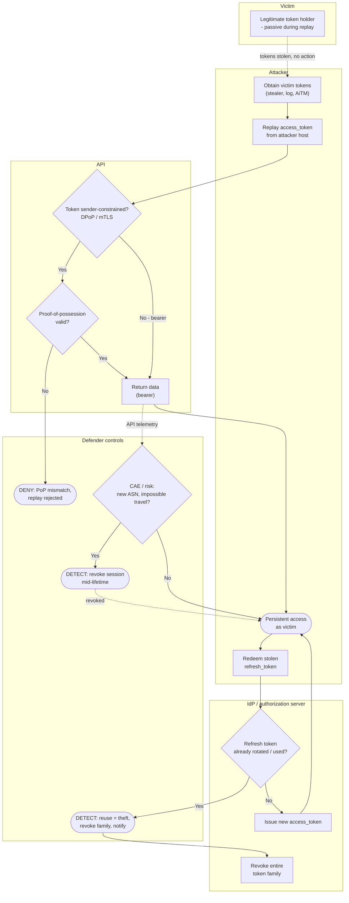

# Token Theft & Replay — Swimlane Diagram

Lanes for Attacker, Victim, IdP, and Defender controls. Solid arrows are the replay path; dashed
arrows into the Defender lane are proof checks, reuse detection, and revocation.

Notes

- The Victim lane is passive — a hallmark of replay — so controls must live at the **API**
  (proof-of-possession) and **IdP** (reuse detection), not at a login step.
- Outright prevention is `P2 --> No` (sender-constrained token); refresh-token **reuse detection**
  (`I1 --> Yes`) contains a stolen refresh token by revoking the family.
- The weak path is `P1 --> bearer` plus `I1 --> No` (no rotation): without binding or rotation,
  replay is hard to catch — hence DPoP/mTLS and rotation are the durable fixes.
