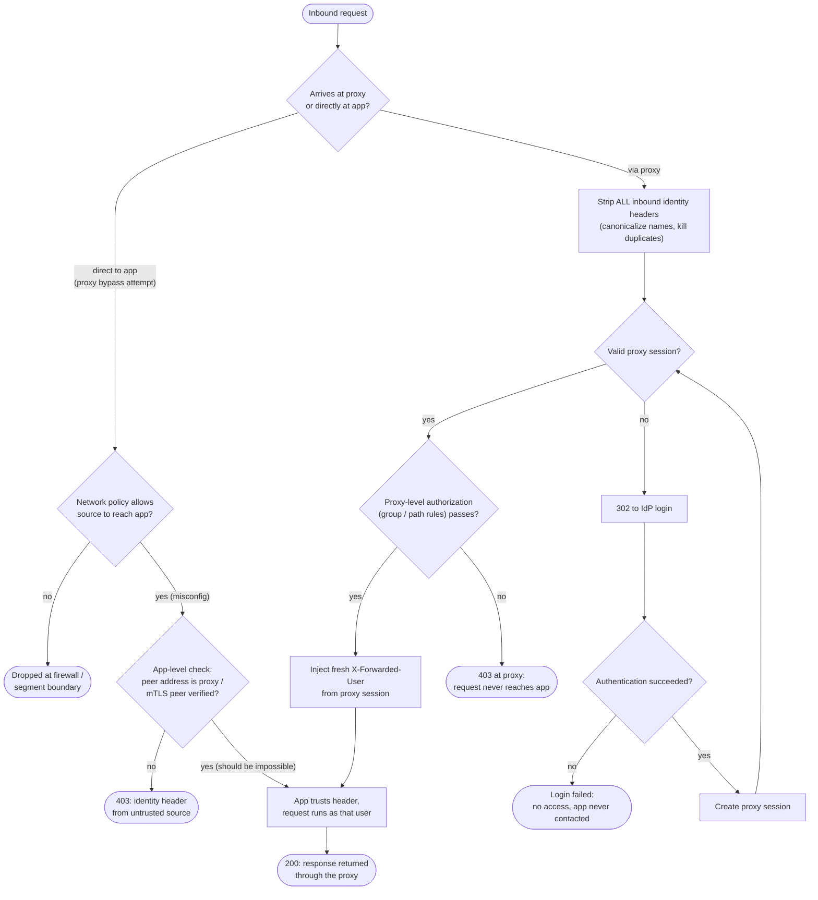

# Header-Based SSO — Decision Flowchart

Two decision surfaces: the proxy (authentication, header hygiene) and the app
(should I trust this header?). The spoofing path is drawn explicitly.

```mermaid
flowchart TD
    Start(["Inbound request"]) --> Path{"Arrives at proxy<br/>or directly at app?"}

    %% ----- direct-to-app attack path -----
    Path -->|"direct to app<br/>(proxy bypass attempt)"| Net{"Network policy allows<br/>source to reach app?"}
    Net -->|no| EBlock(["Dropped at firewall /<br/>segment boundary"])
    Net -->|"yes (misconfig)"| PeerChk{"App-level check:<br/>peer address is proxy /<br/>mTLS peer verified?"}
    PeerChk -->|no| ESpoof(["403: identity header<br/>from untrusted source"])
    PeerChk -->|"yes (should be impossible)"| Trust

    %% ----- normal proxy path -----
    Path -->|via proxy| Strip["Strip ALL inbound identity headers<br/>(canonicalize names, kill duplicates)"]
    Strip --> Sess{"Valid proxy session?"}
    Sess -->|no| Login["302 to IdP login"]
    Login --> AuthOk{"Authentication succeeded?"}
    AuthOk -->|no| EAuth(["Login failed:<br/>no access, app never contacted"])
    AuthOk -->|yes| Mint["Create proxy session"] --> Sess
    Sess -->|yes| Authz{"Proxy-level authorization<br/>(group / path rules) passes?"}
    Authz -->|no| EDeny(["403 at proxy:<br/>request never reaches app"])
    Authz -->|yes| Inject["Inject fresh X-Forwarded-User<br/>from proxy session"]
    Inject --> Trust["App trusts header,<br/>request runs as that user"]
    Trust --> OK(["200: response returned<br/>through the proxy"])
```
