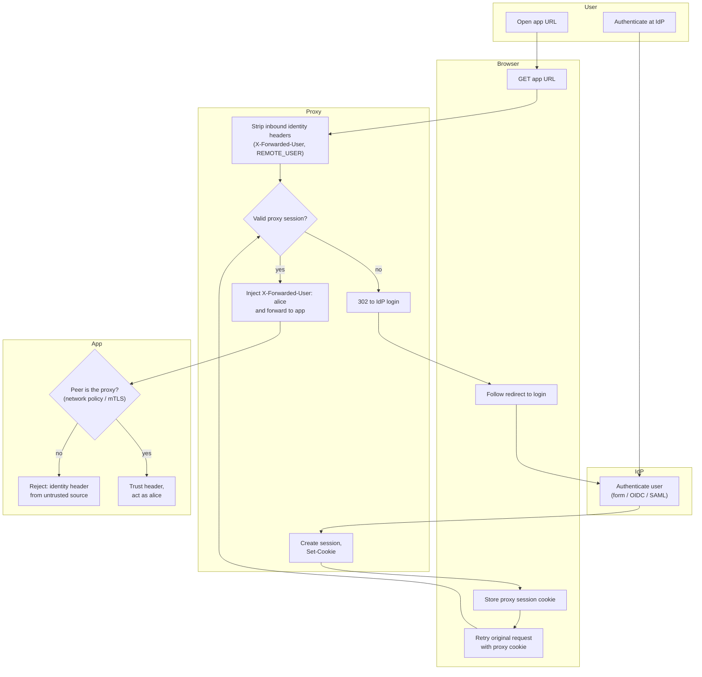

# Header-Based SSO — Swimlane

The Proxy-to-App handoff is the trust boundary: the app must be unreachable
except through the proxy.

```mermaid
flowchart TD
    subgraph User
        U1["Open app URL"]
        U2["Authenticate at IdP"]
    end

    subgraph Browser
        B1["GET app URL"]
        B2["Follow redirect to login"]
        B3["Store proxy session cookie"]
        B4["Retry original request<br/>with proxy cookie"]
    end

    subgraph Proxy
        P1["Strip inbound identity headers<br/>(X-Forwarded-User, REMOTE_USER)"]
        P2{"Valid proxy session?"}
        P3["302 to IdP login"]
        P4["Create session,<br/>Set-Cookie"]
        P5["Inject X-Forwarded-User: alice<br/>and forward to app"]
    end

    subgraph IdP
        I1["Authenticate user<br/>(form / OIDC / SAML)"]
    end

    subgraph App
        A1{"Peer is the proxy?<br/>(network policy / mTLS)"}
        A2["Trust header,<br/>act as alice"]
        A3["Reject: identity header<br/>from untrusted source"]
    end

    U1 --> B1 --> P1 --> P2
    P2 -->|no| P3 --> B2 --> I1
    U2 --> I1
    I1 --> P4 --> B3 --> B4 --> P2
    P2 -->|yes| P5 --> A1
    A1 -->|yes| A2
    A1 -->|no| A3
```
