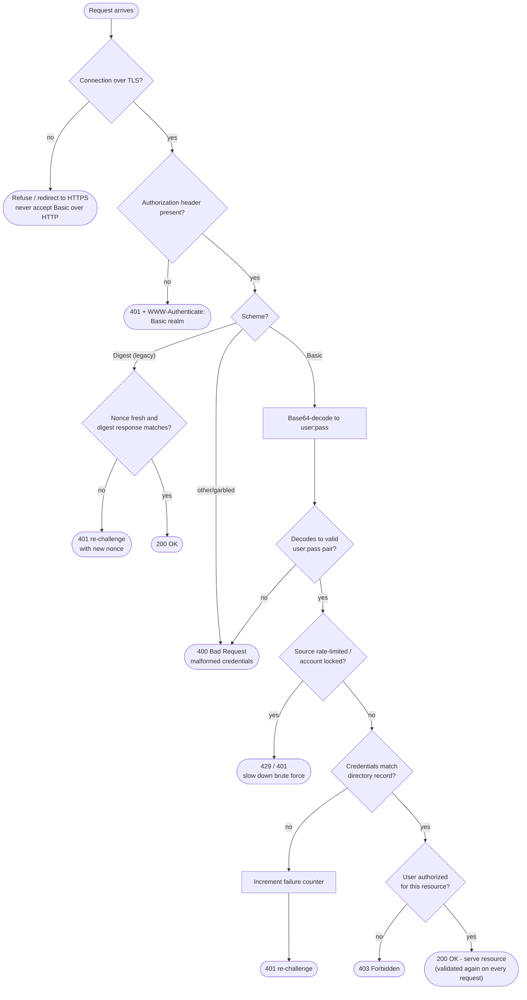

# HTTP Basic Authentication — Decision Flowchart

Server-side decision logic, including the TLS gate that makes Basic safe to use
at all.

```mermaid
flowchart TD
    Start(["Request arrives"]) --> Tls{"Connection over TLS?"}
    Tls -->|no| ETls(["Refuse / redirect to HTTPS<br/>never accept Basic over HTTP"])
    Tls -->|yes| HasAuth{"Authorization header present?"}

    HasAuth -->|no| Challenge(["401 + WWW-Authenticate:<br/>Basic realm"])
    HasAuth -->|yes| Scheme{"Scheme?"}

    Scheme -->|"Basic"| Decode["Base64-decode to user:pass"]
    Scheme -->|"Digest (legacy)"| Nonce{"Nonce fresh and<br/>digest response matches?"}
    Scheme -->|"other/garbled"| EBadHdr(["400 Bad Request<br/>malformed credentials"])

    Nonce -->|no| ReChal(["401 re-challenge<br/>with new nonce"])
    Nonce -->|yes| OKD(["200 OK"])

    Decode --> Parse{"Decodes to valid<br/>user:pass pair?"}
    Parse -->|no| EBadHdr
    Parse -->|yes| RateLtd{"Source rate-limited /<br/>account locked?"}
    RateLtd -->|yes| E429(["429 / 401<br/>slow down brute force"])
    RateLtd -->|no| Valid{"Credentials match<br/>directory record?"}
    Valid -->|no| Count["Increment failure counter"] --> ReChal2(["401 re-challenge"])
    Valid -->|yes| Authz{"User authorized<br/>for this resource?"}
    Authz -->|no| E403(["403 Forbidden"])
    Authz -->|yes| OK(["200 OK - serve resource<br/>(validated again on every request)"])
```
