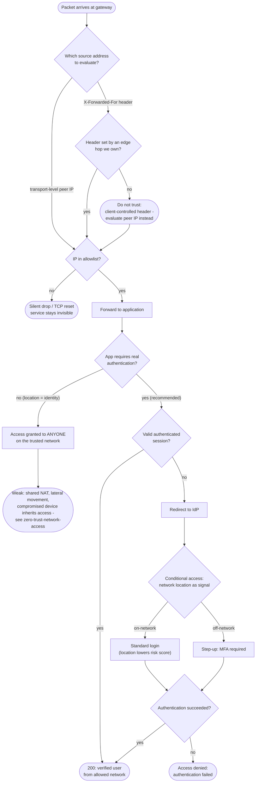

# IP Allowlist / Network-Location Authentication — Decision Flowchart

Decision logic at the gateway and app, including the trap of trusting
client-supplied forwarding headers, and the step-up path that turns a bare
allowlist into layered security.

