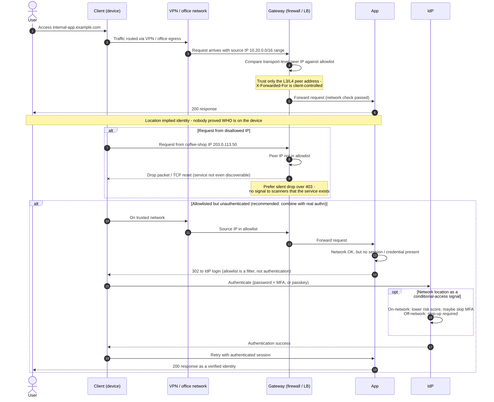

# IP Allowlist / Network-Location Authentication — Sequence Diagram

Happy path: request from an allowlisted source reaches the app. Alternates:
disallowed IP, and the recommended combination — allowlisted but still required
to authenticate (allowlist as filter, IdP as authentication).

