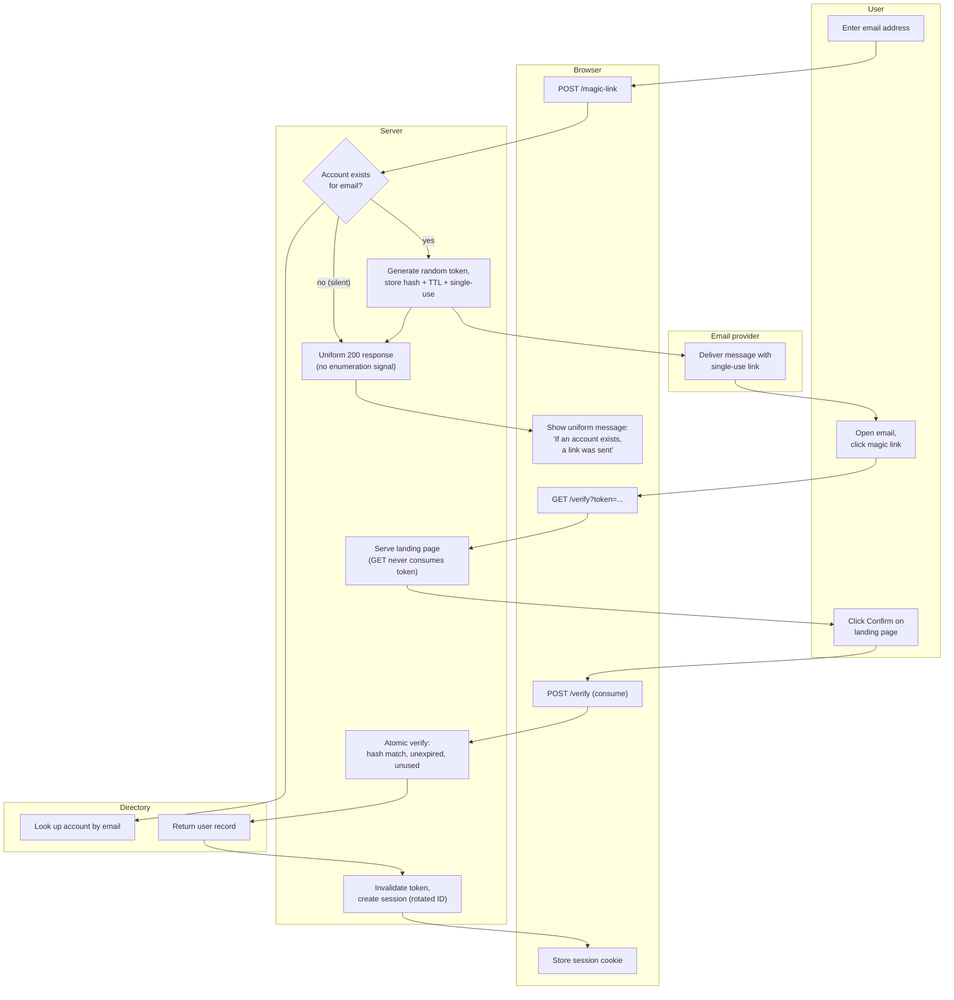

# Magic Link — Swimlane

```mermaid
flowchart TD
    subgraph User
        U1["Enter email address"]
        U2["Open email,<br/>click magic link"]
        U3["Click Confirm on<br/>landing page"]
    end

    subgraph Browser
        B1["POST /magic-link"]
        B2["Show uniform message:<br/>'If an account exists,<br/>a link was sent'"]
        B3["GET /verify?token=..."]
        B4["POST /verify (consume)"]
        B5["Store session cookie"]
    end

    subgraph Server
        S1{"Account exists<br/>for email?"}
        S2["Generate random token,<br/>store hash + TTL + single-use"]
        S3["Uniform 200 response<br/>(no enumeration signal)"]
        S4["Serve landing page<br/>(GET never consumes token)"]
        S5["Atomic verify:<br/>hash match, unexpired, unused"]
        S6["Invalidate token,<br/>create session (rotated ID)"]
    end

    subgraph Email["Email provider"]
        E1["Deliver message with<br/>single-use link"]
    end

    subgraph Directory
        D1["Look up account by email"]
        D2["Return user record"]
    end

    U1 --> B1 --> S1
    S1 --> D1
    S1 -->|yes| S2 --> E1
    S1 -->|"no (silent)"| S3
    S2 --> S3 --> B2
    E1 --> U2 --> B3 --> S4
    S4 --> U3 --> B4 --> S5
    S5 --> D2 --> S6 --> B5
```
