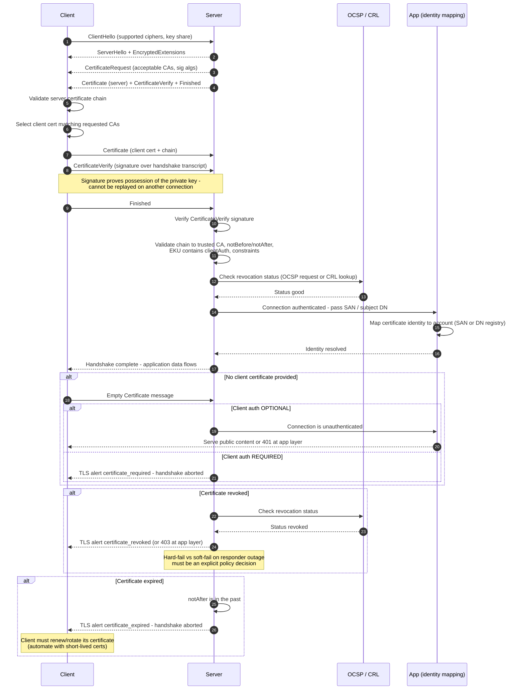

# Mutual TLS — Sequence Diagram

Happy path: TLS 1.3-style handshake with client authentication, validation, and
identity mapping. Alternates: no certificate (optional vs required), revoked
certificate, expired certificate.

