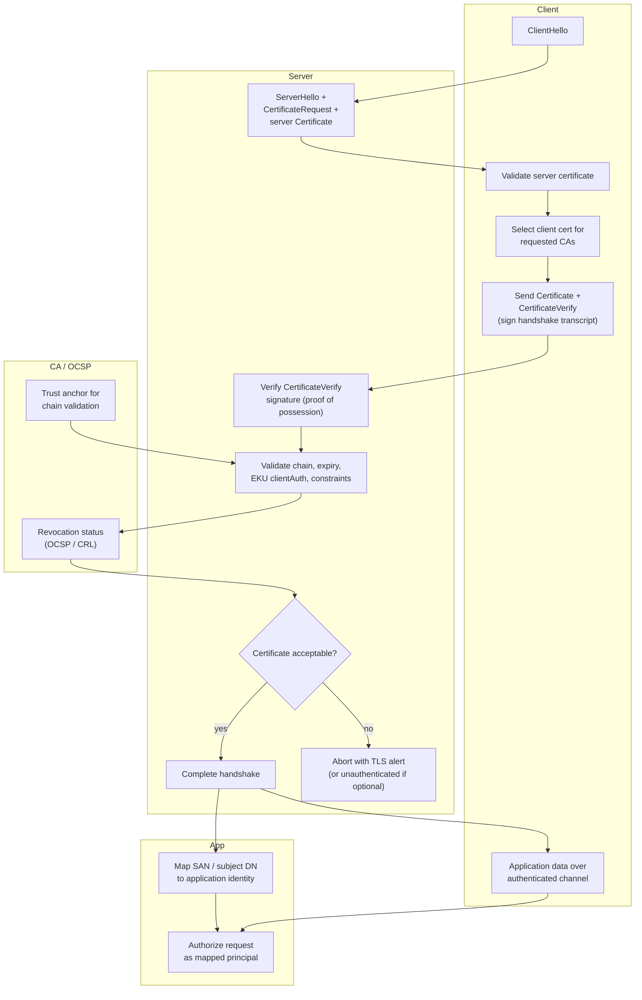

# Mutual TLS — Swimlane

```mermaid
flowchart TD
    subgraph Client
        C1["ClientHello"]
        C2["Validate server certificate"]
        C3["Select client cert for<br/>requested CAs"]
        C4["Send Certificate +<br/>CertificateVerify<br/>(sign handshake transcript)"]
        C5["Application data over<br/>authenticated channel"]
    end

    subgraph Server
        S1["ServerHello +<br/>CertificateRequest +<br/>server Certificate"]
        S2["Verify CertificateVerify<br/>signature (proof of possession)"]
        S3["Validate chain, expiry,<br/>EKU clientAuth, constraints"]
        S4{"Certificate acceptable?"}
        S5["Complete handshake"]
        S6["Abort with TLS alert<br/>(or unauthenticated if optional)"]
    end

    subgraph CA_OCSP["CA / OCSP"]
        R1["Trust anchor for<br/>chain validation"]
        R2["Revocation status<br/>(OCSP / CRL)"]
    end

    subgraph App
        A1["Map SAN / subject DN<br/>to application identity"]
        A2["Authorize request<br/>as mapped principal"]
    end

    C1 --> S1
    S1 --> C2
    C2 --> C3 --> C4
    C4 --> S2 --> S3
    R1 --> S3
    S3 --> R2
    R2 --> S4
    S4 -->|yes| S5
    S4 -->|no| S6
    S5 --> A1 --> A2
    S5 --> C5
    C5 --> A2
```
