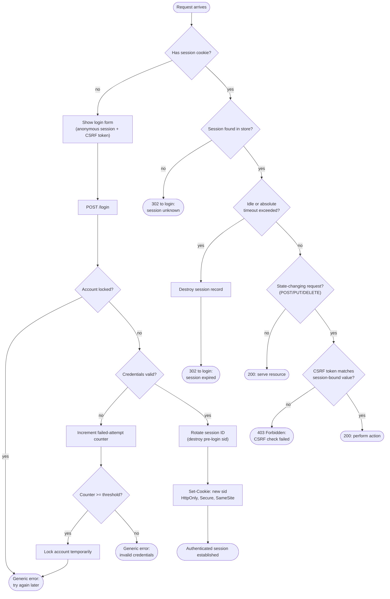

# Session Cookie Authentication — Decision Flowchart

Branch-focused view: credential validation with lockout, session validation on
subsequent requests, and the CSRF gate for state-changing requests.

