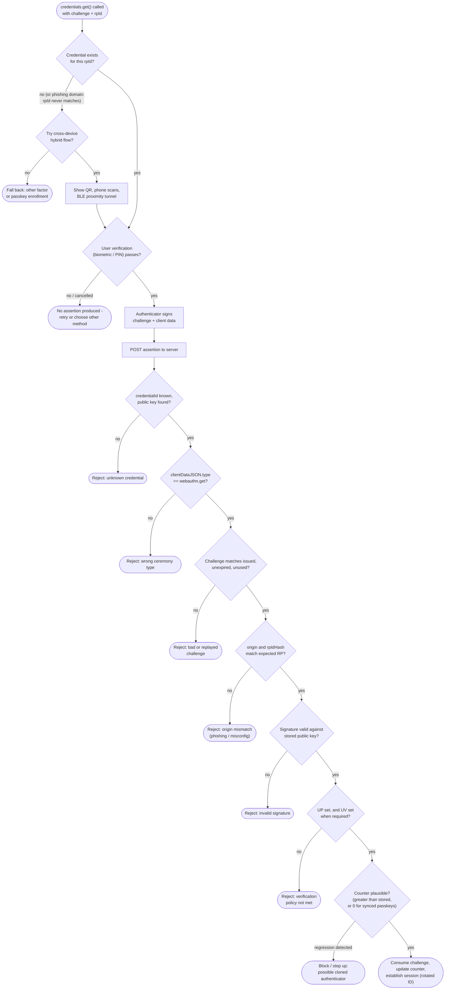

# WebAuthn / Passkey Authentication — Verification Flowchart

Client-side branching (credential discovery, user verification, hybrid
cross-device) followed by the server-side assertion validation pipeline.

