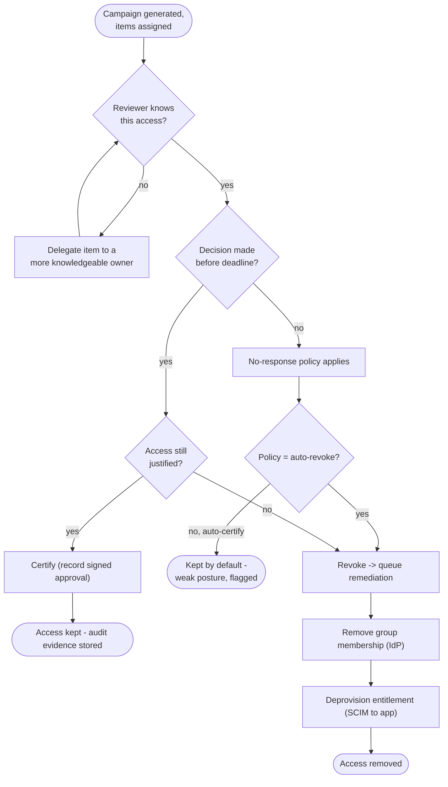

# Access Review & Certification — Decision Flowchart

Per-item decision logic from assignment through the deadline, with explicit terminals for
certified-kept and revoked-and-deprovisioned outcomes.

Notes

- A reviewer who does not recognize an access item should delegate, not guess-certify —
  blind certification is the main way certifications fail as a control.
- The auto-revoke branch is the recommended no-response policy; auto-certify exists but is
  flagged as a weak posture because it lets access persist unattested.

Related: [README](README.md) | [Sequence](sequence.md) | [Swimlane](swimlane.md)
