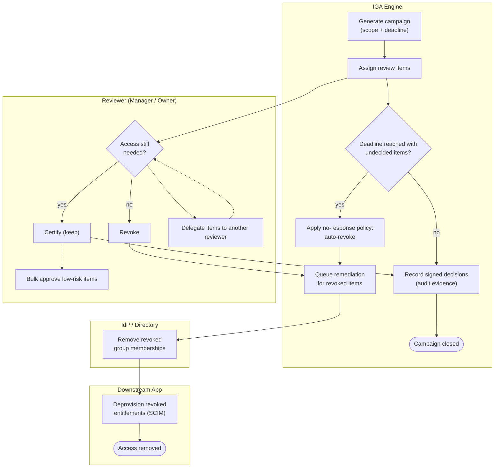

# Access Review & Certification — Swimlane Diagram

One lane per actor. The IGA lane runs the campaign and remediation; the reviewer lane makes
per-item decisions; revocations cross into the IdP and app lanes.

Related: [README](README.md) | [Sequence](sequence.md) | [Flowchart](flowchart.md)
