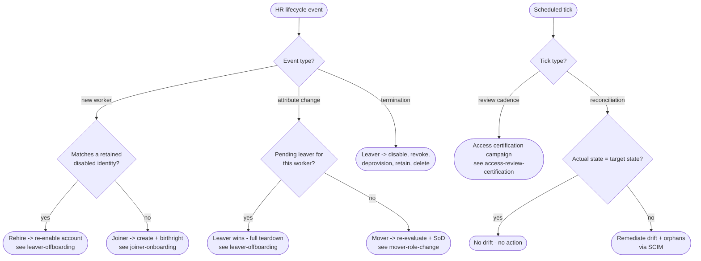

# JML Orchestration — Decision Flowchart

Event-routing logic: how the IGA engine classifies an HR event and dispatches it to the
correct transition, plus the reconciliation backstop. Each terminal points to the detailed
diagram for that path.

Notes

- Ordering conflicts resolve toward the most access-restrictive outcome: a pending leaver
  overrides an in-flight mover so a departing worker never lands in an over-provisioned
  state.
- Two clocks drive the system: HR events (real-time) and scheduled ticks (reviews and
  reconciliation) — the latter converges any state the former missed.

Related: [README](README.md) | [Sequence](sequence.md) | [Swimlane](swimlane.md)
