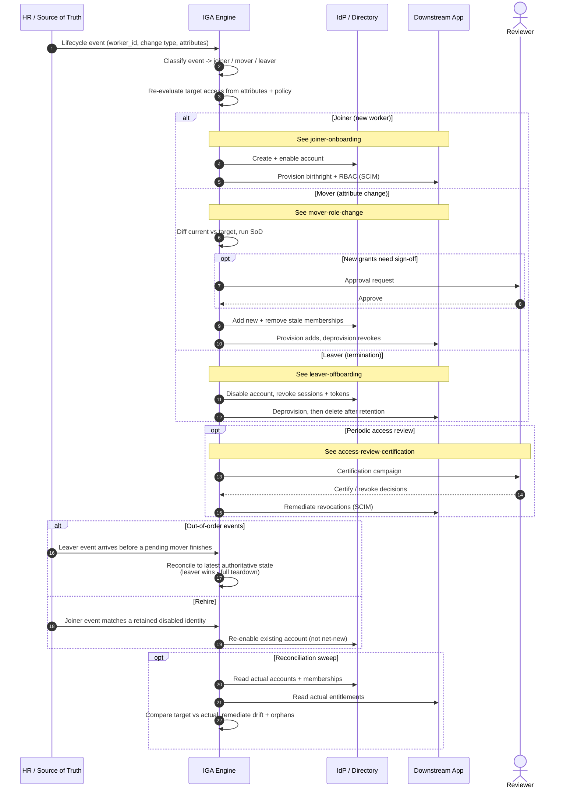

# JML Orchestration — Sequence Diagram

High-level view: one HR event stream drives IGA, which routes to the joiner, mover, or
leaver flow. Happy path shows the common shape; alternates cover out-of-order events,
rehire, and the reconciliation sweep. Each branch links to its detailed diagram.

Notes

- Every transition is the same three beats — event, re-evaluation, provisioning — which is
  why a single IGA engine can own all of JML.
- The reconciliation sweep is the safety net: even if an event is missed or an app drifts,
  periodic target-vs-actual comparison converges the system back to policy.

Related: [README](README.md) | [Swimlane](swimlane.md) | [Flowchart](flowchart.md)
