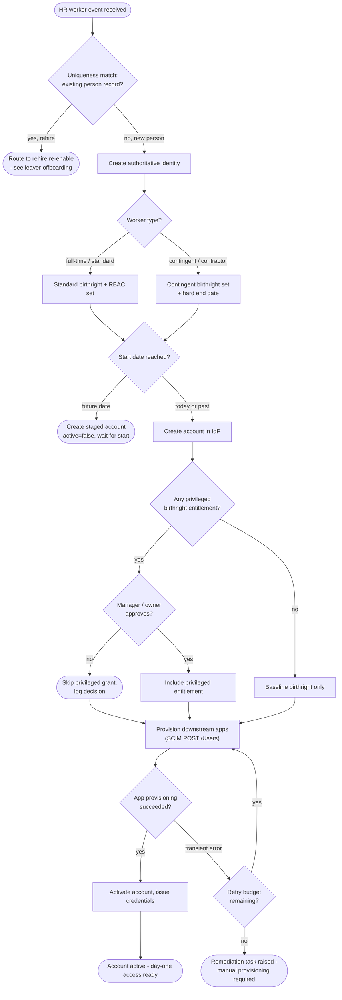

# Joiner — Onboarding Decision Flowchart

Provisioning decision logic from HR event to active account, with explicit terminals for
approval rejection and exhausted retries.

Notes

- A uniqueness hit on an existing record is treated as a **rehire**, not a new joiner —
  it diverts to the [leaver](../leaver-offboarding/README.md) re-enable path to avoid
  orphaned duplicate accounts.
- Retries are bounded; exhaustion produces a human task rather than silently dropping the
  provisioning.

Related: [README](README.md) | [Sequence](sequence.md) | [Swimlane](swimlane.md)
