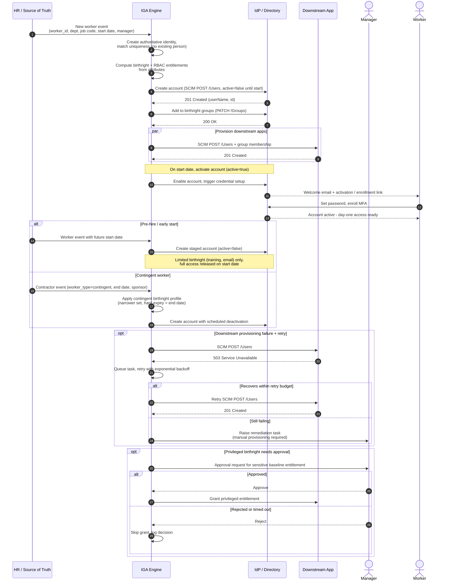

# Joiner — Onboarding Sequence Diagram

Happy path first (standard full-time hire, birthright auto-granted), then pre-hire,
contingent worker, provisioning-failure retry, and privileged-birthright approval
alternates.

Notes

- The account is created **before** the start date but kept inactive; activation and
  credential issuance are gated on the HR start date.
- Provisioning is idempotent — retries must not create duplicate accounts, which is why
  IGA matches uniqueness up front.

Related: [README](README.md) | [Swimlane](swimlane.md) | [Flowchart](flowchart.md)
