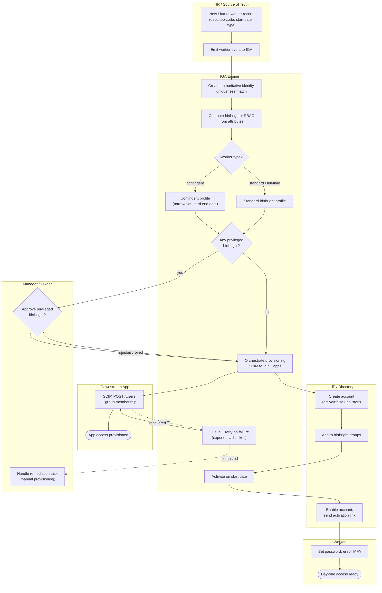

# Joiner — Onboarding Swimlane Diagram

One lane per actor. The HR event flows left-to-right through IGA into the IdP and apps,
with the manager lane handling the privileged-approval and failure-remediation branches.

Related: [README](README.md) | [Sequence](sequence.md) | [Flowchart](flowchart.md)
