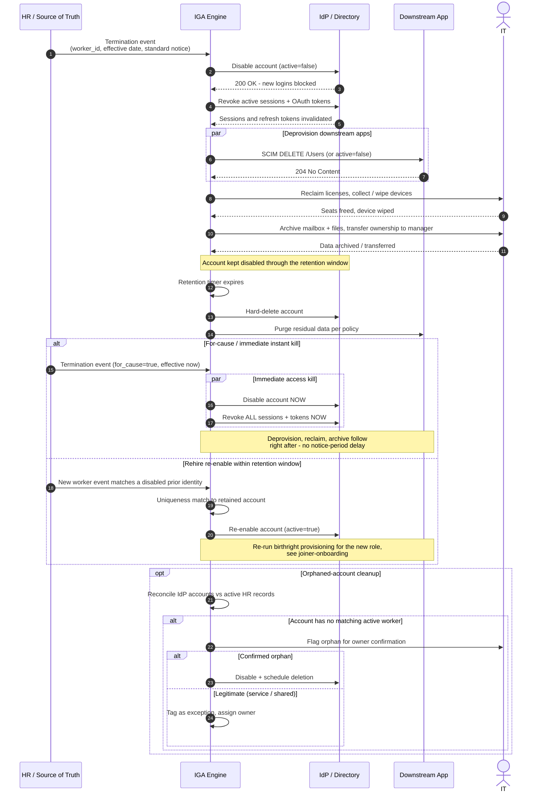

# Leaver — Offboarding Sequence Diagram

Happy path first (standard notice-period termination in ordered steps), then for-cause
instant kill, rehire re-enable, and orphaned-account cleanup alternates.

Notes

- Disable and token/session revocation come first and, in the for-cause path, run in
  parallel — the goal is to stop access in seconds, then clean up over minutes/hours.
- Deletion is deferred until the retention window closes, because legal hold, payroll, and
  audit may still need the record.

Related: [README](README.md) | [Swimlane](swimlane.md) | [Flowchart](flowchart.md)
