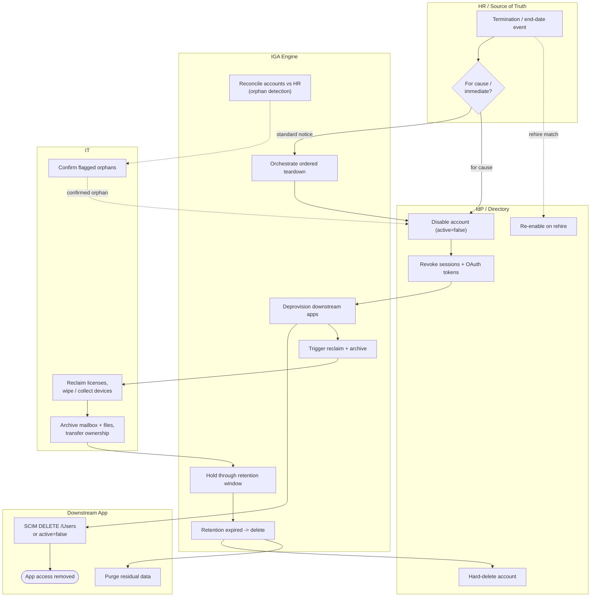

# Leaver — Offboarding Swimlane Diagram

One lane per actor. The IGA lane sequences the ordered teardown; disable and revoke land in
the IdP lane, deprovision in the app lane, and reclaim/archive in the IT lane.

Related: [README](README.md) | [Sequence](sequence.md) | [Flowchart](flowchart.md)
