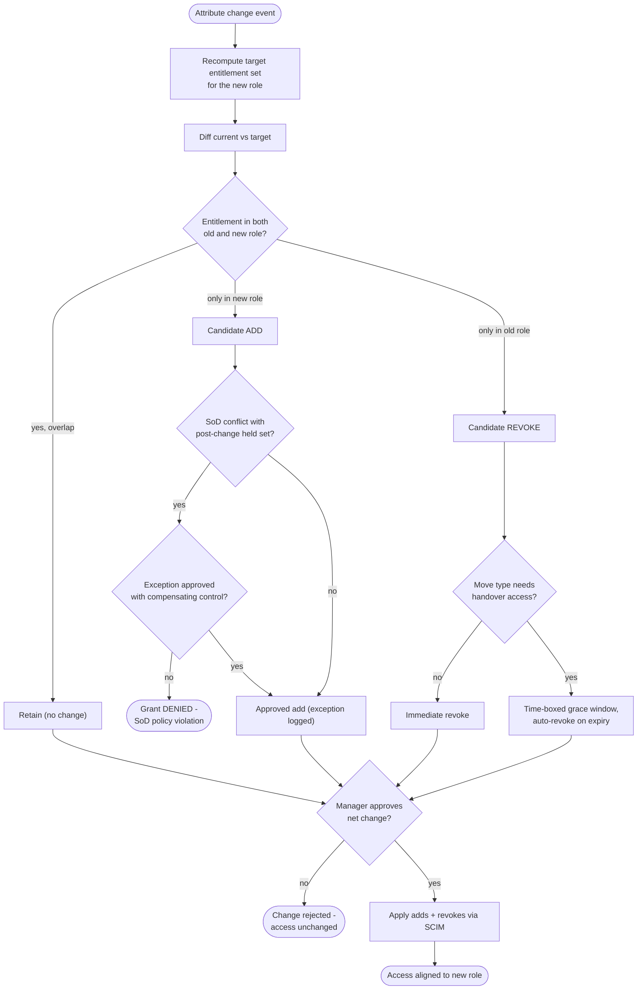

# Mover — Role Change Decision Flowchart

Grant/revoke decision logic centered on the diff and the SoD gate, with explicit terminals
for SoD denial and rejected approvals.

Notes

- Overlapping entitlements are retained rather than revoked-then-re-added, which avoids a
  needless access gap during the move.
- The SoD check runs against the *held* set after the change, so a conflict with retained
  access is caught, not just conflicts among the new grants.

Related: [README](README.md) | [Sequence](sequence.md) | [Swimlane](swimlane.md)
