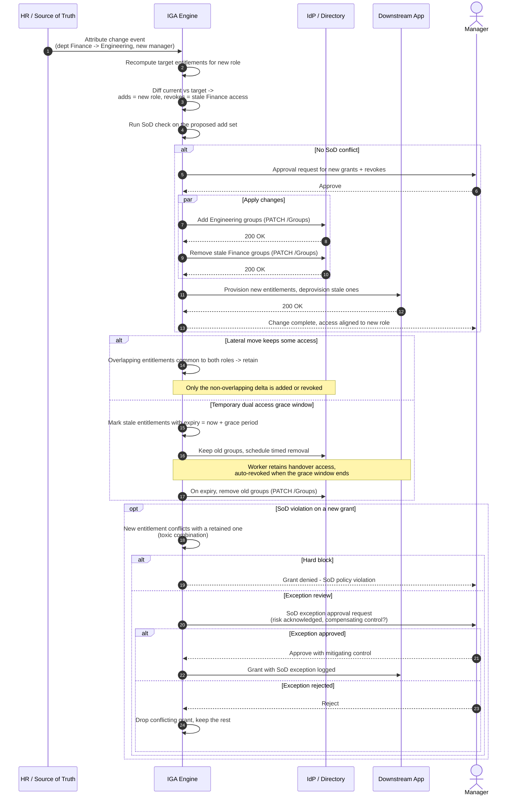

# Mover — Role Change Sequence Diagram

Happy path first (attribute change, re-evaluate, add new + revoke stale with approval),
then lateral-move retention, grace-window dual access, and SoD-violation alternates.

Notes

- The revoke half of the diff is the whole point — omitting it is exactly how privilege
  creep accumulates across a career of moves.
- SoD is evaluated against the *post-change* held set (adds plus retained), not just the
  adds, so a conflict with kept access is caught.

Related: [README](README.md) | [Swimlane](swimlane.md) | [Flowchart](flowchart.md)
