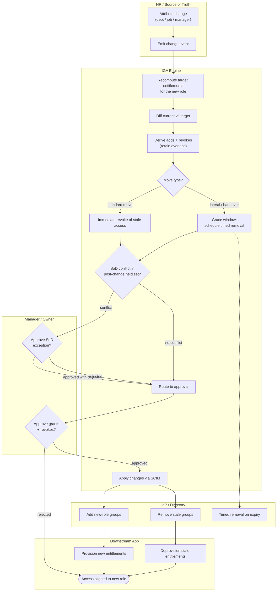

# Mover — Role Change Swimlane Diagram

One lane per actor. The IGA lane carries the re-evaluation and SoD logic; adds and revokes
fan out to the IdP and app lanes, and the manager lane gates grants and exceptions.

Related: [README](README.md) | [Sequence](sequence.md) | [Flowchart](flowchart.md)
