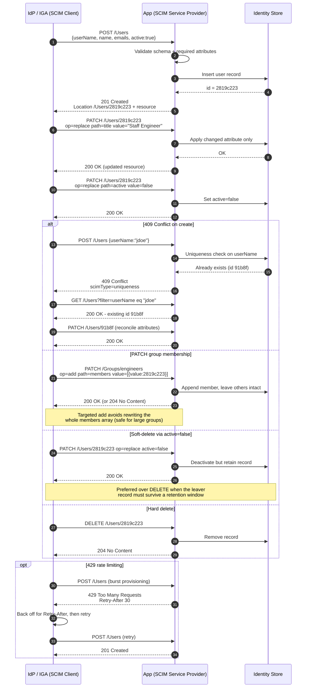

# SCIM 2.0 Provisioning — Sequence Diagram

Happy path first (create, patch, deactivate lifecycle), then 409-conflict reconciliation,
group-membership patch, soft-delete, and 429 rate-limit alternates.

Notes

- SCIM `PATCH` sends only the delta, which is why mover group changes use it instead of a
  full `PUT` that would clobber unrelated attributes.
- A `409` with `scimType=uniqueness` is the normal signal to switch from create to update —
  a robust client never treats it as a hard failure.

Related: [README](README.md) | [Swimlane](swimlane.md) | [Flowchart](flowchart.md)
