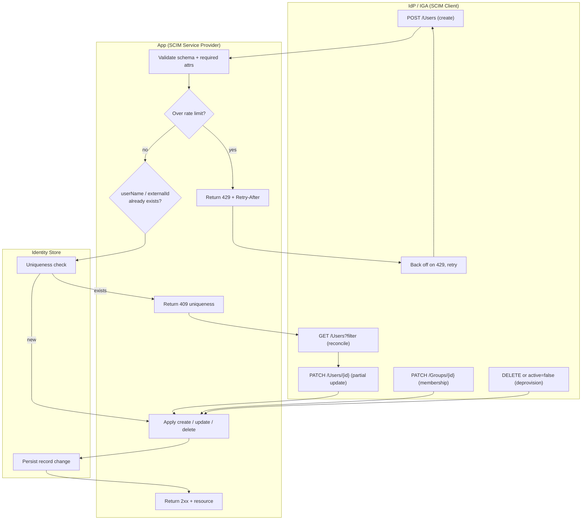

# SCIM 2.0 Provisioning — Swimlane Diagram

One lane per actor: the SCIM client (IdP/IGA), the service provider (app), and its backing
store. Arrows are the HTTP calls and their responses.

Related: [README](README.md) | [Sequence](sequence.md) | [Flowchart](flowchart.md)
