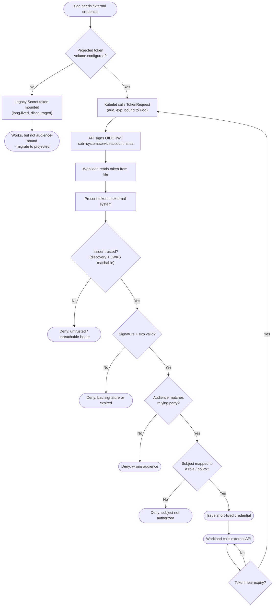

# Kubernetes Projected ServiceAccount Token — Decision Flowchart

Every gate from token request through external validation, with error terminals drawn
explicitly.

Notes

- The audience gate (`Aud`) is the core protection of the projected model: a token minted for
  the cloud STS cannot be replayed against a different relying party.
- Expiry loops back to TokenRequest via the kubelet, so credentials stay continuously fresh
  with no human and no stored secret.
- The `Legacy` branch is kept only to contrast: a long-lived Secret token skips the audience
  and expiry gates entirely, which is exactly why projected tokens replace it.

Related: [README](README.md) | [Sequence](sequence.md) | [Swimlane](swimlane.md)
