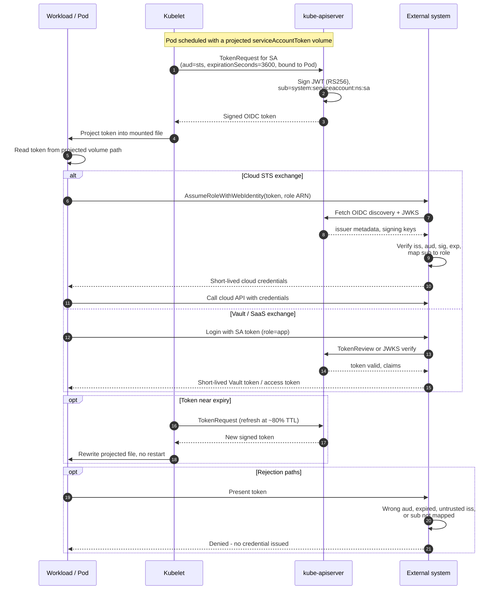

# Kubernetes Projected ServiceAccount Token — Sequence Diagram

Happy path first: the kubelet mints a projected token via TokenRequest, the workload reads
it and exchanges it with an external system. Alternates: Vault exchange, refresh near expiry,
and rejection paths.

Notes

- The bound-object reference ties the token to the Pod, so the token is invalidated when the
  Pod is deleted even before `exp`.
- The external system verifies the token **offline** against JWKS in the common case, no
  callback into the cluster is required, only the initial discovery fetch is.
- The kubelet, not the workload, owns refresh: the app simply re-reads the file, it never
  calls TokenRequest itself.

Related: [README](README.md) | [Swimlane](swimlane.md) | [Flowchart](flowchart.md)
