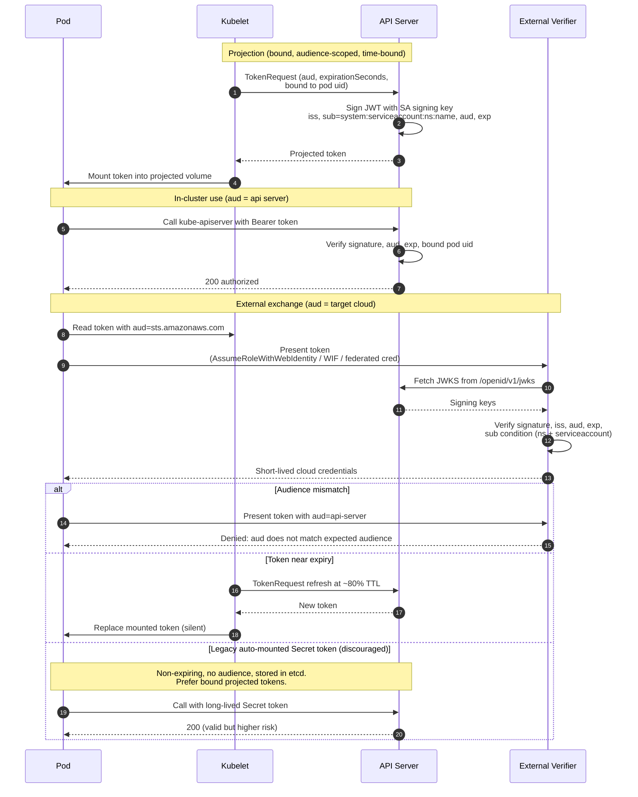

# Kubernetes ServiceAccount Token — Sequence Diagram

Happy path first: the kubelet projects a bound token, the pod uses it in-cluster, then
exchanges an audience-scoped token at an external STS. Alternates: audience mismatch,
refresh on expiry, and the legacy Secret token.



Notes

- Binding the token to the pod uid means it stops validating once the pod terminates, unlike the legacy Secret token which stayed valid indefinitely.
- The same JWT is usable in-cluster or externally only when its `aud` matches the verifier; a token is minted per audience rather than reused across trust boundaries.
- External verifiers validate offline against the published JWKS, so no call back into the cluster's auth path is needed beyond fetching keys.
```
```
</content>
