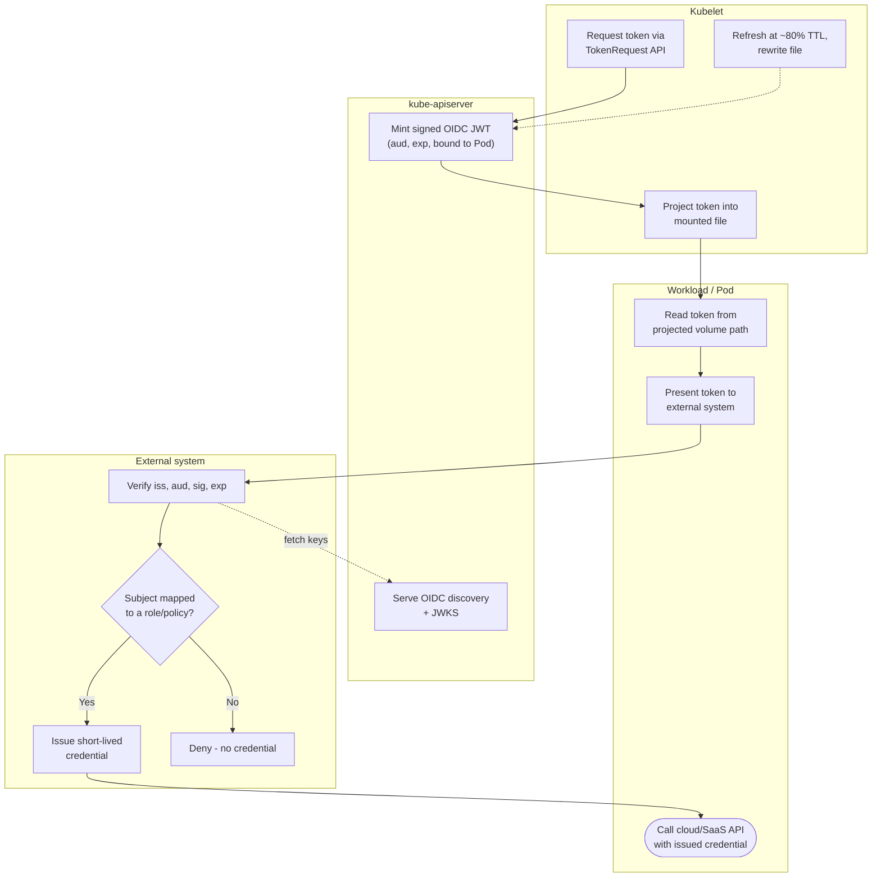

# Kubernetes Projected ServiceAccount Token — Swimlane Diagram

One lane per actor. The kubelet mints and projects the token; the workload exchanges it; the
external system validates against the cluster's OIDC issuer.

Notes

- The kubelet lane is the only one that talks to the TokenRequest API; the workload never
  mints its own token.
- The External lane verifies against the API server's OIDC endpoints (`A2`), not against a
  shared secret — that is what makes the exchange keyless.
- The `E2` gate is where a token with a valid signature but an unmapped subject is denied —
  see [flowchart.md](flowchart.md) for the full gate set.

Related: [README](README.md) | [Sequence](sequence.md) | [Flowchart](flowchart.md)
