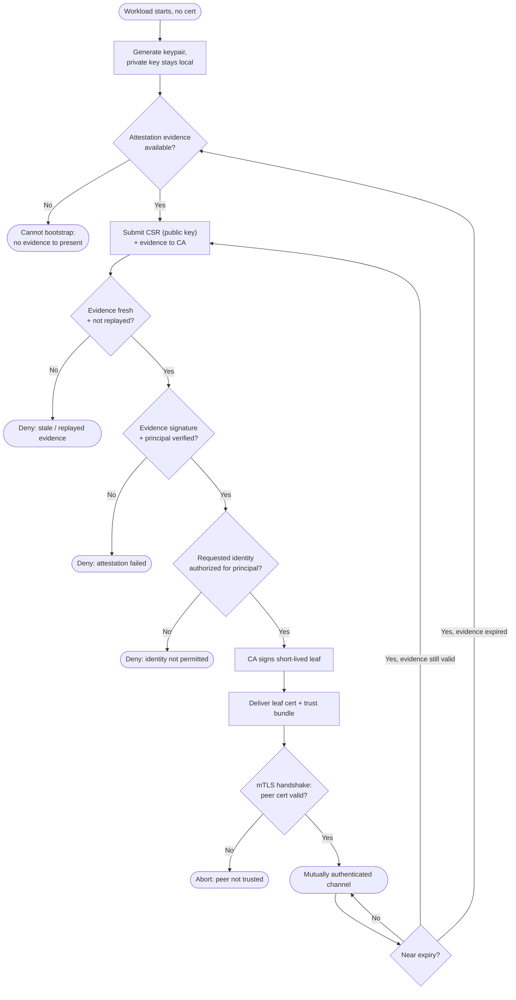

# Mutual TLS Bootstrap — Decision Flowchart

Every gate from keypair generation through attestation and authorization to a usable mTLS
certificate, with error terminals drawn explicitly.

Notes

- Two independent gates protect issuance: attestation (`Fresh` + `Sig`) proves *which*
  principal is asking, authorization (`Authz`) decides *which* identity it may hold.
- Rotation loops back to the CSR when only the certificate is aging, or all the way back to
  re-attestation when the evidence itself has expired.
- The handshake gate is mutual: the workload also validates the peer against the returned
  trust bundle, so a valid leaf is necessary but not sufficient to talk to an untrusted peer.

Related: [README](./README.md) | [Sequence](./sequence.md) | [Swimlane](./swimlane.md)
