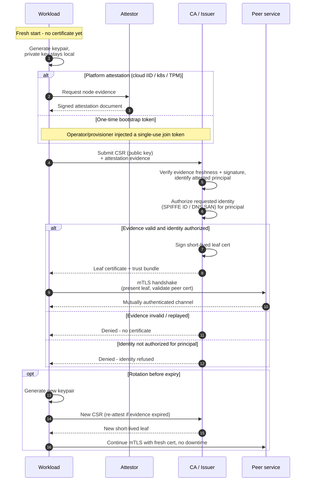

# Mutual TLS Bootstrap — Sequence Diagram

Happy path first: the workload attests, submits a CSR, receives a leaf certificate, then uses
it for mutual TLS. Alternates: bootstrap-token evidence, rotation, and failure paths.

Notes

- The private key is generated on the workload and never sent; the CSR carries only the
  public key to be certified.
- Attestation answers "which principal is this", authorization answers "which identity may it
  hold" — both gates must pass before the CA signs.
- Rotation re-runs the same CSR path; if the attestation evidence has also expired the
  workload re-attests first, otherwise it simply re-keys.

Related: [README](./README.md) | [Swimlane](./swimlane.md) | [Flowchart](./flowchart.md)
