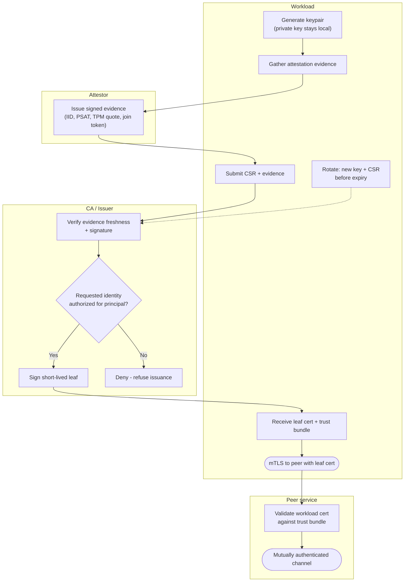

# Mutual TLS Bootstrap — Swimlane Diagram

One lane per actor. Attestation precedes the CSR; the CA gates issuance; the workload then
uses the leaf for mutual TLS.

Notes

- The Attestor lane is consulted once at bootstrap (and again only if evidence expires during
  rotation); it never sees the private key.
- The `C2` gate separates attestation from authorization — a genuinely attested node is still
  refused an identity it is not entitled to.
- Rotation (`W6`) re-enters the CA lane at `C1`, keeping the certificate continuously fresh —
  see [flowchart.md](flowchart.md) for the full gate set.

Related: [README](README.md) | [Sequence](sequence.md) | [Flowchart](flowchart.md)
