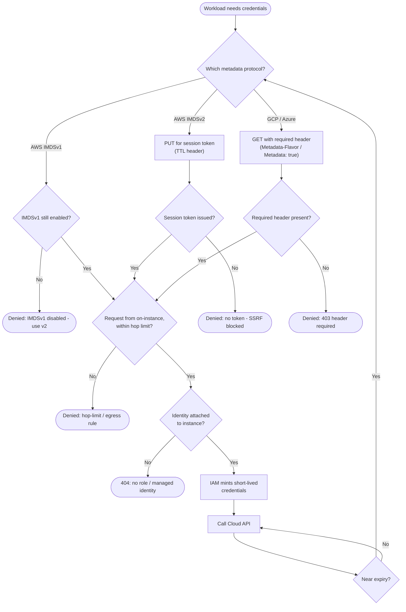

# Secretless Instance Identity — Decision Flowchart

Request validation and SSRF-defense gates, from the metadata call to credential use, with
explicit deny terminals.

Notes

- The session-token (AWS) and header (GCP/Azure) gates are the first line against SSRF: a blind GET that cannot set headers or do the `PUT` step never reaches the credential path.
- The hop-limit / egress gate is a defense-in-depth layer for cases where an app on the instance is itself the SSRF vector.
- No attached identity is a clean 404, not an error to retry — the fix is an IAM change, not a client change.
</content>
