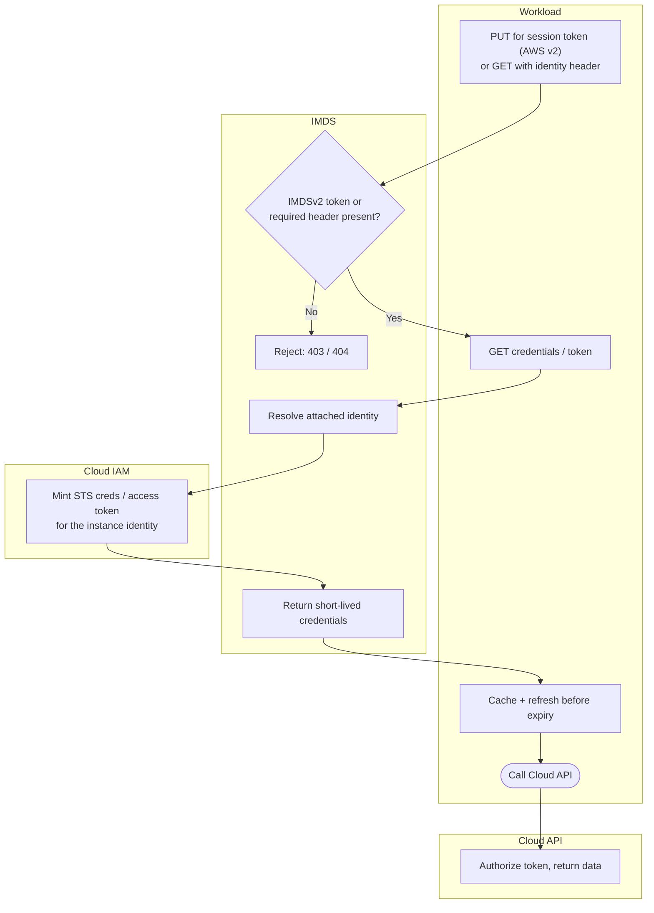

# Secretless Instance Identity — Swimlane Diagram

One lane per actor. The credential handoff never leaves the instance boundary except as
short-lived tokens used against the Cloud API.

Notes

- The `M1` gate is the SSRF defense: without the IMDSv2 session token (AWS) or the identity header (GCP/Azure), the request is rejected before any credential is minted.
- If no identity is attached, `M2` finds nothing and the request returns 404 — see the terminal in [flowchart.md](flowchart.md).
- Credentials are cached and refreshed by the workload (`W3`); the metadata service is polled again before expiry rather than holding a durable secret.
</content>
