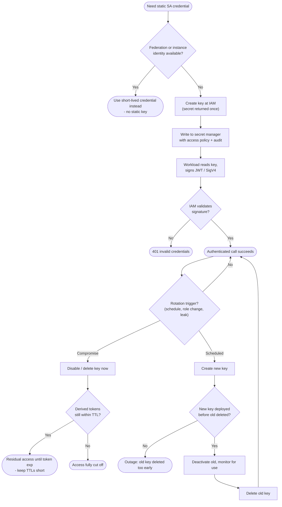

# Service-Account Key Lifecycle — Decision Flowchart

The lifecycle as a decision loop, with the rotation-order outage and compromise paths as
explicit terminals.

Notes

- The first gate pushes callers toward federation or instance identity; a static key is only issued when no attested alternative exists.
- The scheduled-rotation branch enforces make-before-break: the outage terminal is reached precisely when the delete happens before the deploy.
- On compromise, revocation is immediate but not always sufficient — residual tokens live out their TTL, which is why the diagram routes through the `ResidTTL` gate.
</content>
