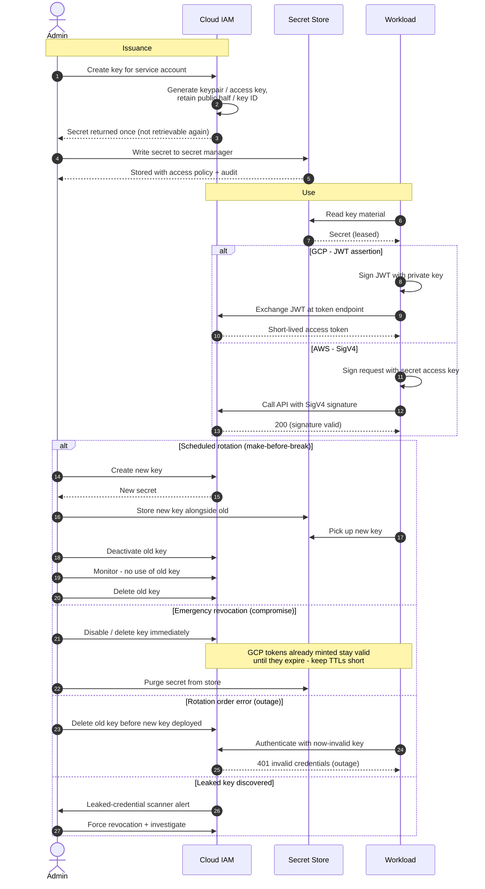

# Service-Account Key Lifecycle — Sequence Diagram

Happy path first: issue, store, and use a key. Alternates: scheduled rotation with an
overlap window, emergency revocation, rotation-order outage, and a leaked-key discovery.

Notes

- The secret is shown to the admin exactly once at creation; the store, not IAM, is the system of record for the material thereafter.
- The make-before-break sequence — create, deploy, deactivate, monitor, delete — is what prevents rotation from causing an outage.
- Revocation is immediate at IAM, but any GCP access tokens already derived from the key live out their TTL, which is why short token lifetimes matter even with static keys.
</content>
