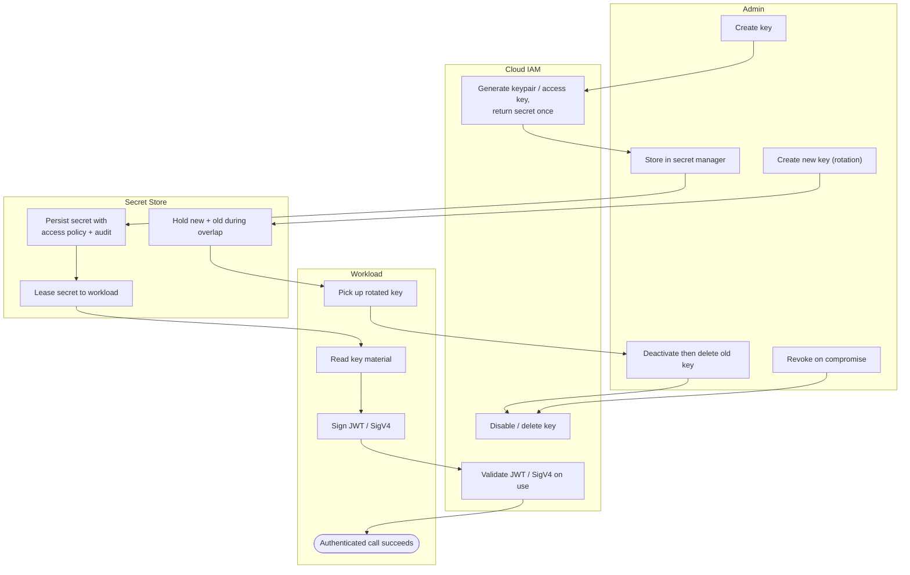

# Service-Account Key Lifecycle — Swimlane Diagram

One lane per actor across the issue / store / use / rotate / revoke loop.

Notes

- The overlap lane (`ST3`) is what makes rotation safe: the store serves both keys until the workload has switched, then the old key is deleted.
- Deleting the old key before `WL4` picks up the new one is the classic self-inflicted outage — see the outage terminal in [flowchart.md](./flowchart.md).
- Revocation (`AD5 --> IA3`) is the same disable/delete action as the end of rotation, just triggered by compromise instead of schedule.
</content>
