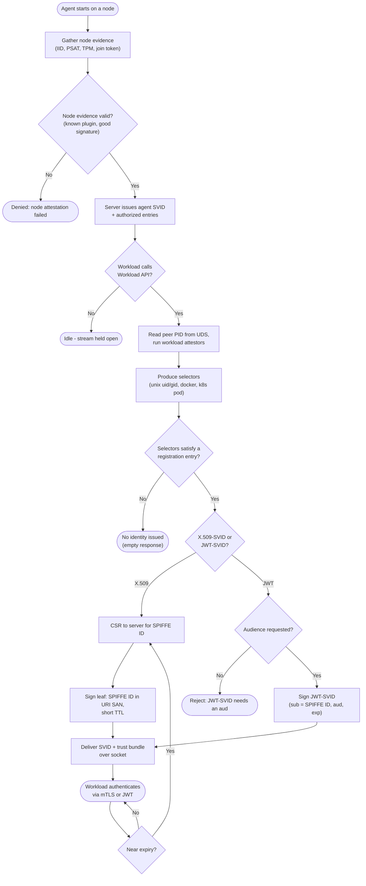

# SPIFFE / SPIRE Issuance — Decision Flowchart

Every gate from node attestation through workload attestation to SVID issuance, with
error terminals drawn explicitly.

Notes

- The node-attestation gate protects the whole node: a failed agent never receives entries, so no workload on that node can be issued an identity.
- Selector matching is strict AND — a workload that satisfies only some of an entry's selectors is treated as no match.
- Rotation loops back to signing before expiry, keeping SVIDs continuously fresh without a human in the loop.
</content>
