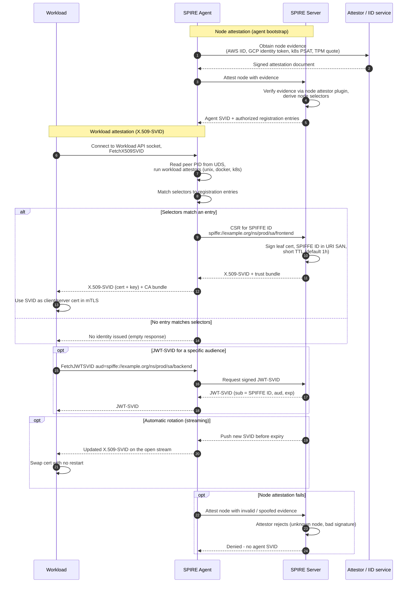

# SPIFFE / SPIRE Issuance — Sequence Diagram

Happy path first: node attestation, then a workload fetching an X.509-SVID. Alternates:
JWT-SVID for a named audience, silent rotation, no matching entry, and node attestation
failure.

Notes

- The agent never sees the workload's private key material beyond what it mints; keys are generated per SVID and delivered over the local socket only.
- Selector matching is AND across an entry's selectors: a workload must satisfy every selector on a registration entry to receive that identity.
- Rotation is push-based over a long-lived gRPC stream, so workloads that keep the stream open get new SVIDs without polling.
</content>
