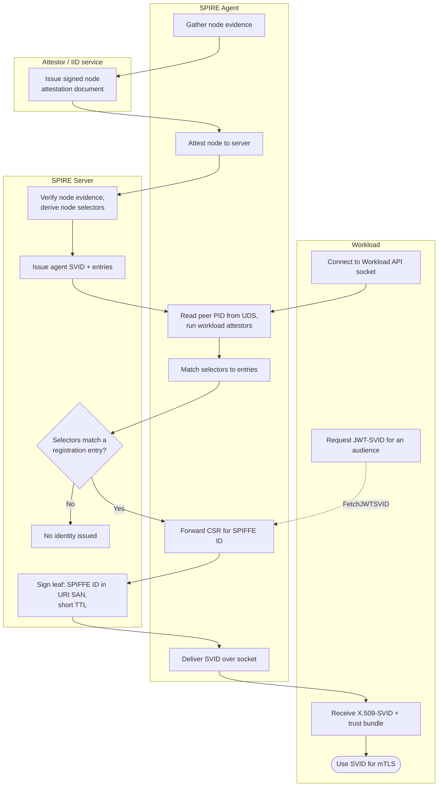

# SPIFFE / SPIRE Issuance — Swimlane Diagram

One lane per actor. The node-attestation handoff (Agent to Server) precedes any
workload-attestation handoff (Workload to Agent to Server).

Notes

- Node attestation happens once at agent startup; workload attestation happens on every Workload API call.
- The `S3` decision is where a workload with no matching entry is silently denied — see [flowchart.md](flowchart.md) for the full gate set.
- JWT-SVID requests reuse the same signing path (`A5` onward) but yield a JWT bound to a named `aud` instead of an X.509 leaf.
</content>
