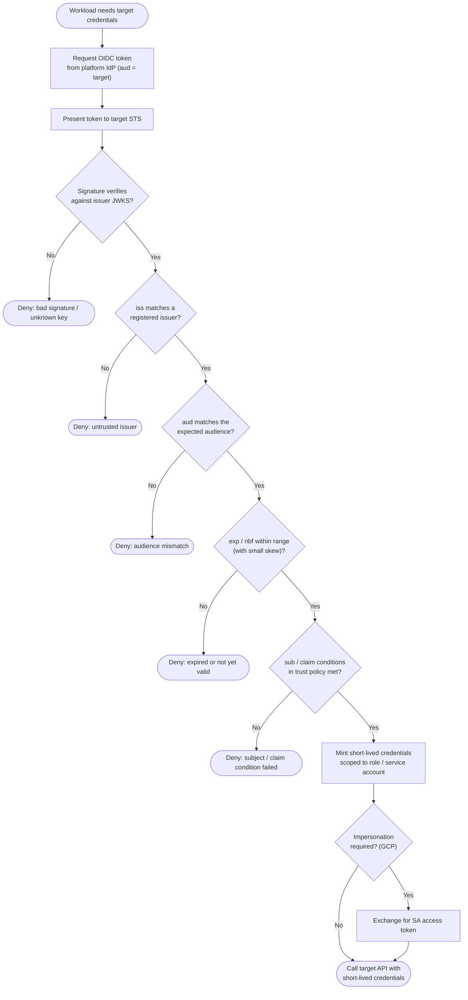

# Workload Identity Federation — Decision Flowchart

The STS validation gates in order, from token receipt to credential issuance, with each
denial drawn as an explicit terminal.

Notes

- Order matters: signature and issuer are checked before audience and conditions, so an untrusted token is rejected before any policy logic runs.
- The audience and condition gates together stop token replay and the confused-deputy problem — the two failure modes unique to federation.
- Credentials are always short-lived; a fresh OIDC token and exchange are needed once they expire, so there is nothing durable to steal.
</content>
