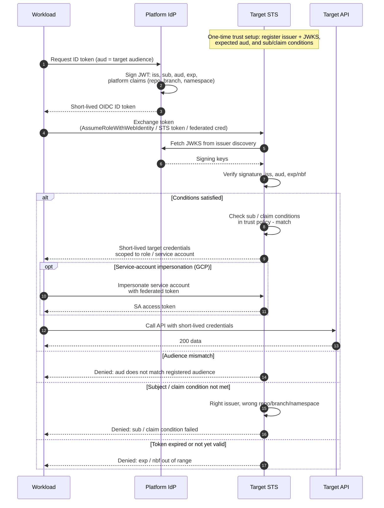

# Workload Identity Federation — Sequence Diagram

Happy path first: obtain platform OIDC token, exchange at the target STS, call the API.
Alternates: audience mismatch, subject/claim condition failure, optional impersonation,
and expired token.

Notes

- The workload never holds a long-lived secret: the only durable state is the trust configuration registered once at the STS.
- JWKS is fetched (and cached) by the STS from the issuer's discovery document, so issuer key rotation is transparent as long as the new keys are published before old ones retire.
- The impersonation step is GCP-specific; AWS and Azure return usable credentials directly from the first exchange.
</content>
