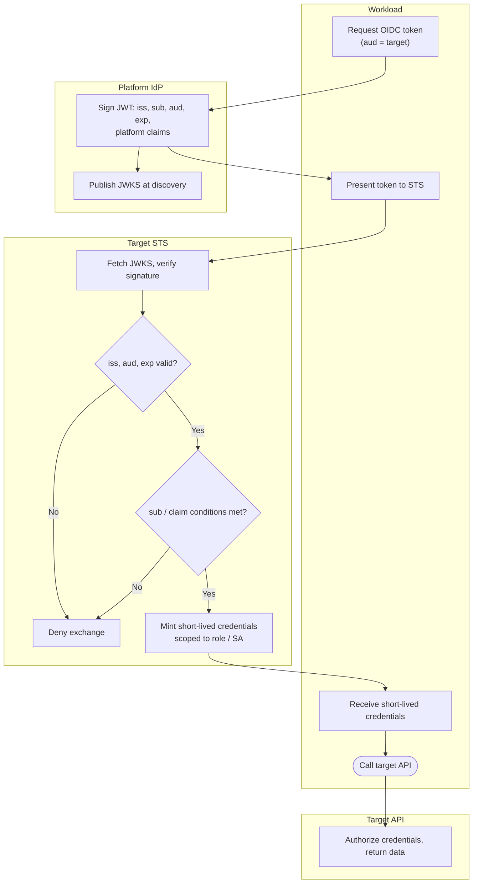

# Workload Identity Federation — Swimlane Diagram

One lane per actor. The exchange handoff (Workload to Target STS) is where the platform
token becomes target credentials.

Notes

- The `S3` condition gate — subject/claim matching — is the confused-deputy defense: right issuer is never enough on its own.
- JWKS publication (`I2`) is a standing capability of the platform IdP, consumed by the STS at `S1`, not a per-request handoff.
- See [flowchart.md](./flowchart.md) for the ordered validation gates and every deny terminal.
</content>
